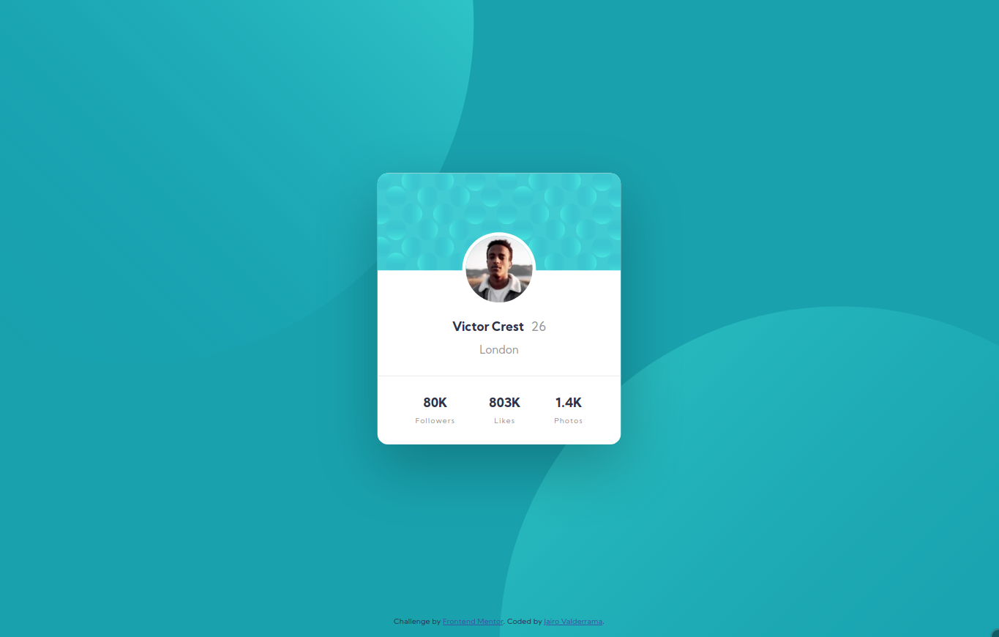

# Frontend Mentor - Profile card component solution

This is a solution to the [Profile card component challenge on Frontend Mentor](https://www.frontendmentor.io/challenges/profile-card-component-cfArpWshJ). Frontend Mentor challenges help you improve your coding skills by building realistic projects.

## Table of contents

- [Overview](#overview)
  - [Screenshot](#screenshot)
  - [Links](#links)
- [My process](#my-process)
  - [Built with](#built-with)
  - [Continued development](#continued-development)
  - [Useful resources](#useful-resources)
- [Author](#author)
- [Acknowledgments](#acknowledgments)

## Overview

### Screenshot

|  |
|--------------------------------------------------|
||

### Links

- Solution URL: [fem-profile-card](https://github.com/jairovg/fem-profile-card)
- Live Site URL: [Not yet](https://github.com/jairovg/fem-profile-card)

## My process

### Built with

- Semantic HTML5 markup
- SASS
- BEM
- Flexbox
- CSS Grid
- Mobile-first workflow

### Continued development

According to the mentoring session, it would be good to handle new challenges with CSS grid only.

### Useful resources

- [A Complete Guide to Flexbox](https://css-tricks.com/snippets/css/a-guide-to-flexbox/) - I always redirect to this usefull resource in mentoring sessions.
- [A Complete Guide to Grid](https://css-tricks.com/snippets/css/complete-guide-grid/) - I'm going to learn CSS grid and found this version in CSS tricks.

## Author

- Frontend Mentor - [@jairovg](https://www.frontendmentor.io/profile/jairovg)

## Acknowledgments

This is the list of the people who participate in the mentoring session:

TBD
